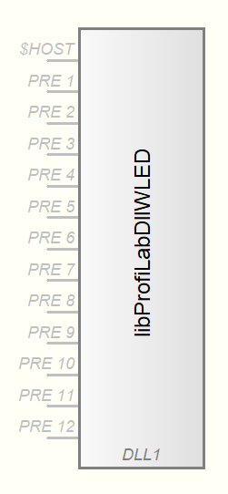
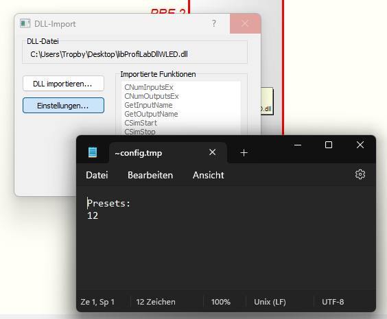

# ProfilabDllWLED

Example DLL for profilab to set presets for WLED devices using the [Tropby/ProfilabDll](https://github.com/Tropby/ProfilabDll) library.

The first input is the IP-Address of the WLED device. The oder inputs can be used to load a pre difined preset.

**ATTENTION:** This DLL is only working for ProfilLab Projects that are saved and reopend before using this DLL. If you only open Profilab and add this DLL you can not change any settings.

## Disclaimer

The Software _ProfiLab-Expert 4.0_ is published and sold by Abacom. I do not have anything to do with this company. All brand names, trademarks and product images used here are the property of their respective owners and are used for descriptive purposes only.

## Settings

The settings are written to a temp file. Therefore the notepad.exe is opened. You just habe to change the value provided and close the notepad.exe.

**Info:** On Windows 11 with the Notepad.exe with tabs. This is not working good. Please close all "notepad.exe" before clicking on the settings button.
